---
author:
- |
  Allan Moreira de Carvalho\
  email [`allan.carvalho@ufabc.edu.br`](mailto:properallan@gmail.com)
bibliography:
- references.bib
date: |
  Federal University of ABC - Santo André, Brazil\
  2023-04-26
title: Flow Reconstruction with Neural Network-based Reduced Order
  Modeling
classoption: "aspectratio=169"
---

# Introduction

{#fig:nozzle_shape
height="\\columnwidth"}

# Introduction

::: columns

:::: {.column width=50%}
{#fig:lhs
height="\\columnwidth"}
::::

:::: {.column width=50%}

             **Minimum**   **Maximum**
  --------- ------------- -------------
    $t_w$     0.0010 m      0.0100 m
   $CP3_y$    -0.0125 m     0.0000 m

  Sampling ranges for the design variables.
::::

:::

# Methodology

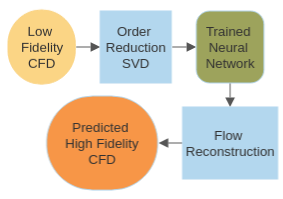{#fig:flow_chart width="0.8\\columnwidth"}

# Step 1: Data Generation using CFD Analysis 

::: columns
:::: {.column width=30%}
### Snapshot Matrices

$$\mathbf{A}_L = \left[ \mathbf{L}^1 | \dots | \mathbf{L}^N\right]^{S_L \times N}     
\label{eq:A_L}$$

$$\mathbf{A}_H = \left[ \mathbf{H}^1 | \dots | \mathbf{H}^N\right]^{S_H \times N}
\label{eq:A_H}$$
::::

:::: {.column width=30%}
### Low fidelity model

$$\mathbf{L} = 
\begin{bmatrix}
    t_w \\
    CP3_y \\
    \mathbf{p}_L\\
    \mathbf{T}_L \\
    \mathbf{M}_L \\
\end{bmatrix}^{1205 \times 1}
    \label{eq:L_snapshot_matrix}$$
::::

:::: {.column width=30%}
### High fidelity model

$$\mathbf{L} = \begin{bmatrix}
    t_w \\
    CP3_y \\
    \mathbf{p}_H\\
    \mathbf{T}_H \\
    \mathbf{T_s} \\
    \mathbf{M}_H \\
\end{bmatrix}^{252842 \times 1 }
    \label{eq:H_snapshot_matrix}$$
::::

:::
## Step 2: Order Reduction using SVD

$$\mathbf{A} = \mathbf{U} {\Sigma} \mathbf{V}^T
\label{eq:svd}$$

# Truncated SVD

::: columns
:::: {.column width=50%}
$$\mathbf{A} \approx  \tilde{\mathbf{U}} \tilde{\Lambda}$$

$$\begin{split}
\%\; Energy_i= \sum_{j=1}^i \frac{\Sigma_k^2}{\sum_{l=1}^r \Sigma_l^2} \times 100 \\ , i = 1,2, \dots, r
\end{split}
\label{eq:energy_SVD}$$

$$\tilde{\Lambda}_L= \tilde{\mathbf{U}}_L ^T\mathbf{A}_L $$
$$\tilde{\Lambda}_H= \tilde{\mathbf{U}}_H^T \mathbf{A}_L $$
 

::::
:::: {.column width=50%}
{#fig:svd_energy
width="\\columnwidth"}
::::
:::

# Step 3: Training the Neural Network

::: columns

:::: {.column width=40%}

## Loss
MSE ($\tilde{\Lambda}_L$, $\tilde{\Lambda}_H$)

## Training
time 15s

{#fig:nn_training
width=0.5\columnwidth}
::::

:::: {.column width=35%}
{#fig:nn
width=0.5\columnwidth}
::::

:::

# Results

- inference time 10s
- 500-fold speedup (1h30m for full order CFD)

::: {#tab:error}
                                      **MAE**         $\mathbf{R^2}$
  ----------------------------- -------------------- ----------------
          $\mathbf{p}$             698.4111 $Pa$          0.9999
          $\mathbf{T}$               2.7631 $K$           0.9958
          $\mathbf{M}$                 0.0026             0.9999
   $\mathbf{T}_{\text{SOLID}}$       8.3579 $K$           0.7179
   $\mathbf{T}_{\text{WALL}}$        16.757 $K$           0.2241
   $\mathbf{q}_{\text{WALL}}$    25386.4482 $W/m^2$       0.8093
:::

# Pressure Flow Field Reconstructions

::: columns
:::: {.column width=30%}
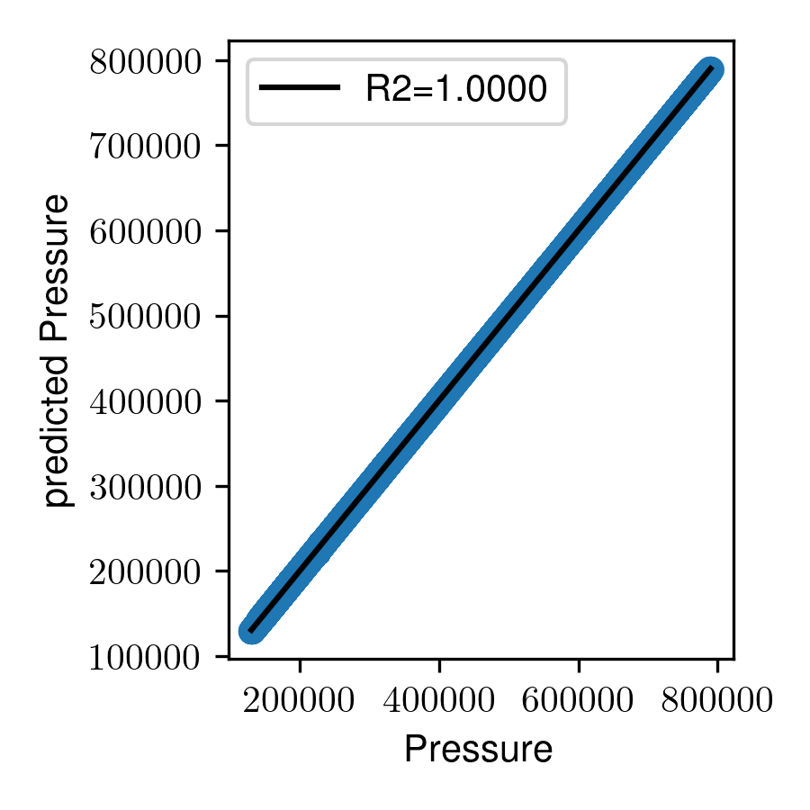{#fig:r2_pressure
width="\\columnwidth"}
::::
:::

::: columns
:::: {.column width=30%}
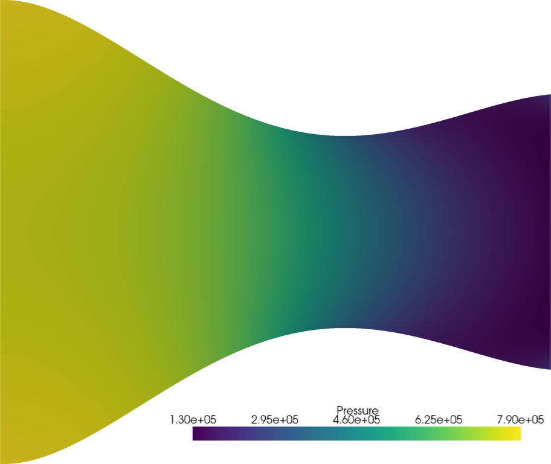{#fig:cfd_pressure
width="0.8\\columnwidth"}
::::

:::: {.column width=30%}
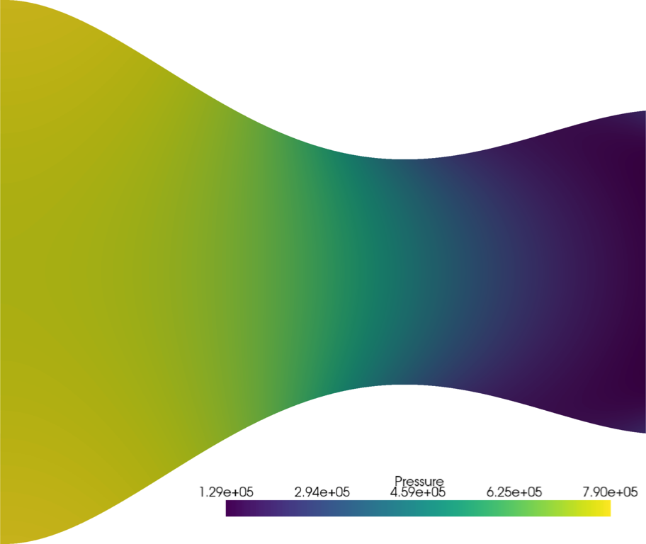{#fig:prediction_pressure
width="0.8\\columnwidth"}
::::

:::: {.column width=30%}
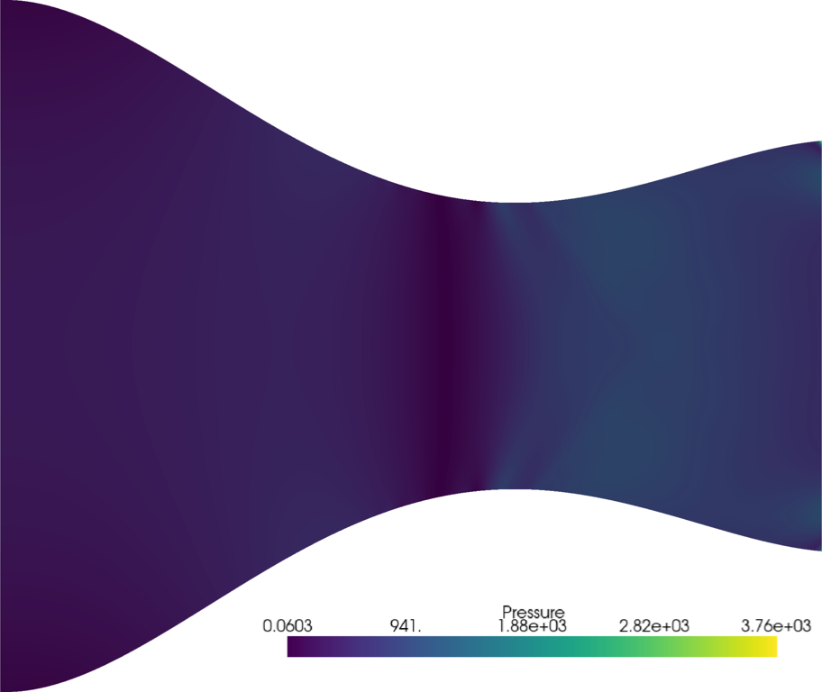{#fig:error_pressure
width="0.8\\columnwidth"}
::::

::: 

# Temperature Flow Field Reconstructions

::: columns
:::: {.column width=30%}
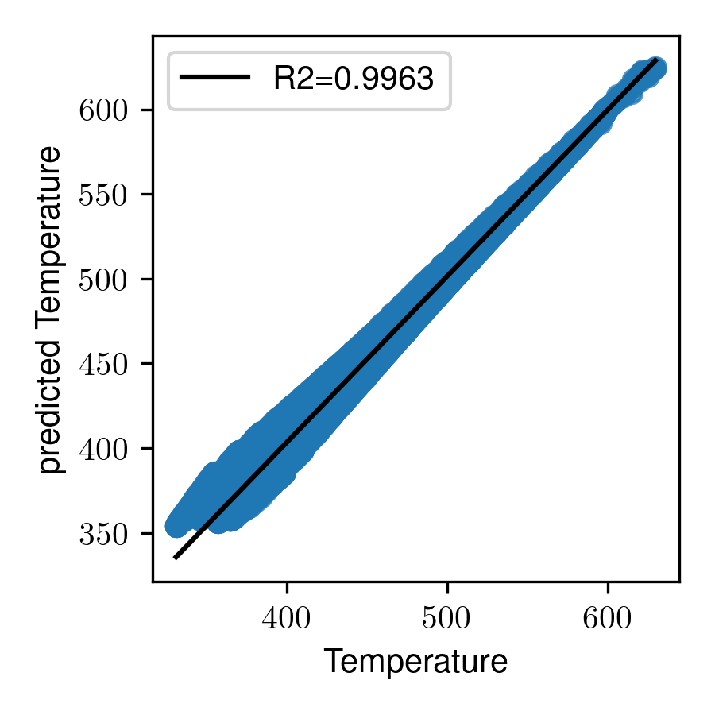{#fig:r2_temperature
width="\\columnwidth"}
::::
:::

::: columns
:::: {.column width=30%}
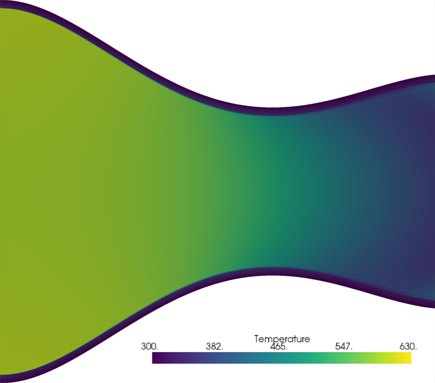{#fig:cfd_temperature
width="0.8\\columnwidth"}
::::

:::: {.column width=30%}
{#fig:prediction_temperature
width="0.8\\columnwidth"}
::::

:::: {.column width=30%}
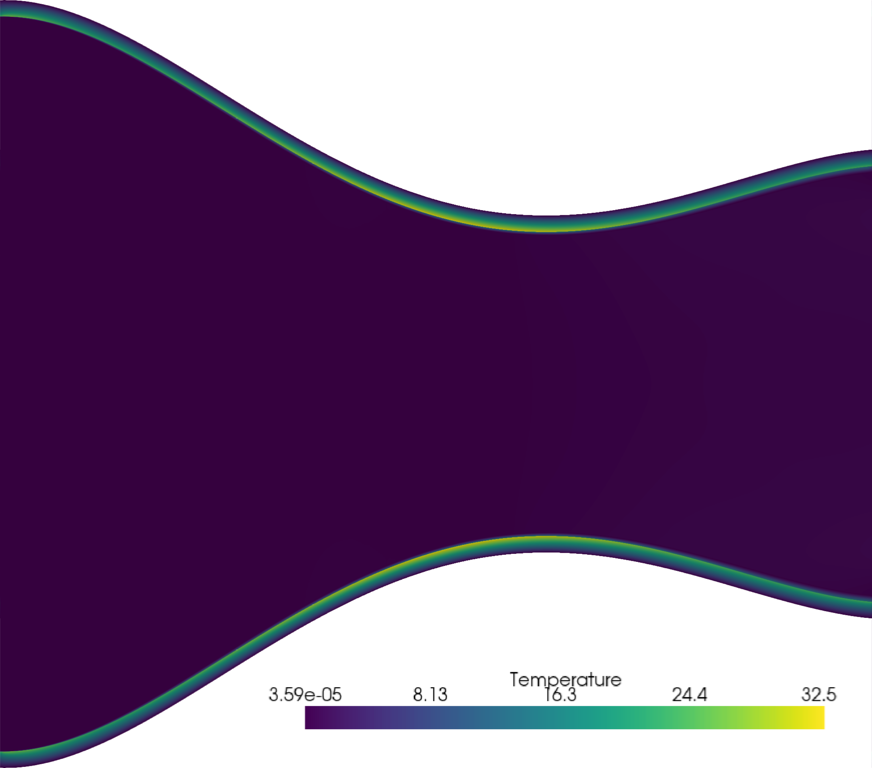{#fig:error_temperature
width="0.8\\columnwidth"}
::::
:::

# Mach Flow Field Reconstruction

::: columns
:::: {.column width=30%}
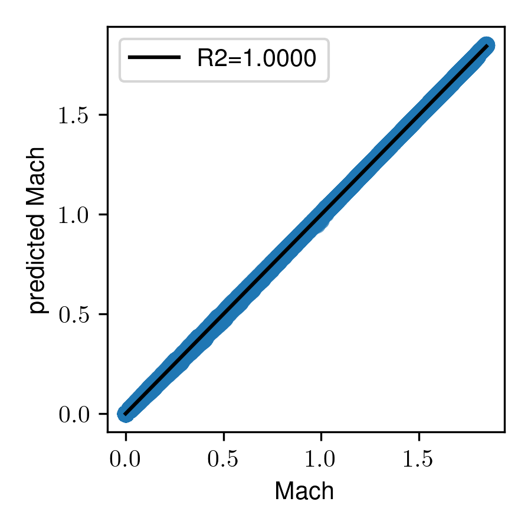{#fig:r2_mach width="\\columnwidth"}
::::
:::

::: columns
:::: {.column width=30%}
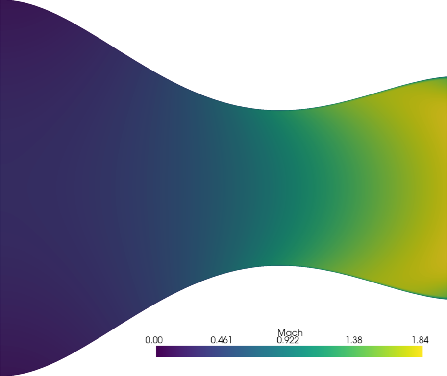{#fig:cfd_mach
width="0.8\\columnwidth"}
::::

:::: {.column width=30%}
{#fig:prediction_mach
width="0.8\\columnwidth"}
::::

:::: {.column width=30%}
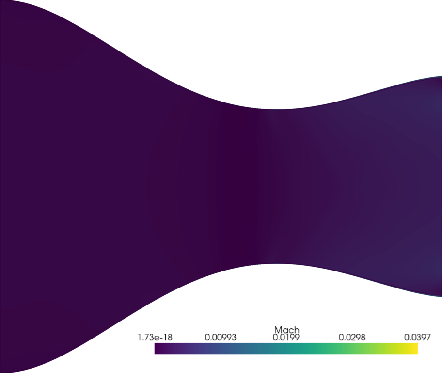{#fig:error_mach
width="0.8\\columnwidth"}
::::
:::

# Wall Heat Flux

::: columns
:::: {.column width=50%}
![Surrogate model prediction of heat flux \[$W/m^2$\] distributions over
test
dataset.](figures/results/Heat_Flux_UPPER_WALL.png){#fig:r2_heat_flux
width="\\columnwidth"}
::::

:::: {.column width=50%}
![Surrogate model prediction of a heat flux \[$W/m^2$\]
distribution.](figures/predicted_wall_heat_flux.pdf){#fig:wall_heat_flux
width="\\columnwidth"}
::::
:::
# Wall Surface Temperature 

::: columns
:::: {.column width=50%}
![Surrogate model prediction of nozzle wall surface temperature \[$K$\]
distributions over test
dataset.](figures/results/Temperature_Solid_INNERWALL.png){#fig:r2_temperature_solid_wall
width="\\columnwidth"}
::::
:::: {.column width=50%}
![Surrogate model prediction of a nozzle wall surface temperature
\[$K$\]
distribution.](figures/predicted_wall_temperature.pdf){#fig:wall_temperature_solid_wall
width="\\columnwidth"}
::::
:::

# Wall Solid Temperature

::: columns
:::: {.column width=30%}
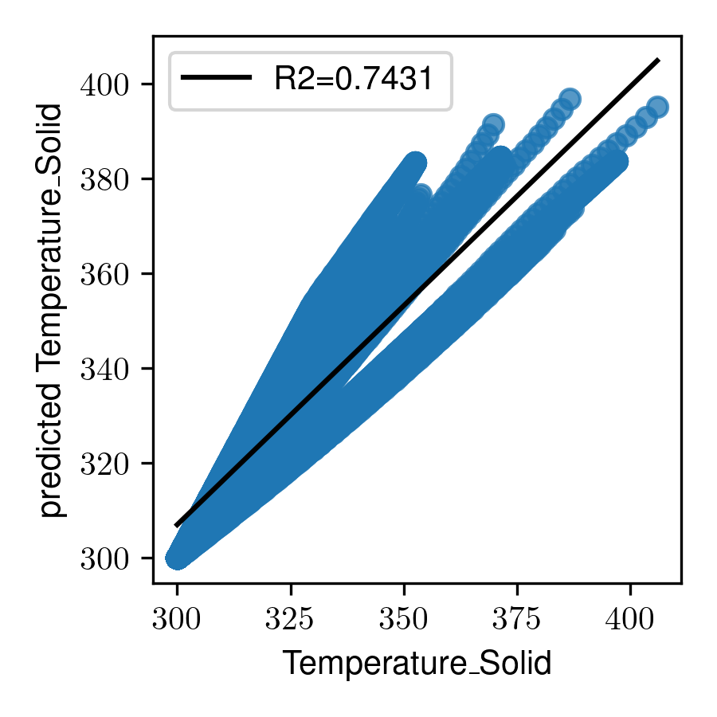{#fig:r2_temperature_solid
width="\\columnwidth"}
::::
:::

::: columns
:::: {.column width=30%}
{#fig:cfd_temperature
width="0.8\\columnwidth"}
::::

:::: {.column width=30%}
{#fig:prediction_temperature
width="0.8\\columnwidth"}
::::

:::: {.column width=30%}
{#fig:error_temperature
width="0.8\\columnwidth"}
::::
:::

# Model Limitations and Improvements Suggestions

- the need for a large amount of data for training. 
- adding more snapshots is expected to improve model accuracy. 
- using individual normalization techniques for each variable.
- perform hyperparameter optimization.
- try more advanced loss functions. 
- trye other optimization algorithms. 
- redesigning the snapshot variables selection

# Conclusion and Future Work

- it effectively reconstructed the fluid flow variables
- performance was limited in reconstructing solid variables
- suggestions for improving the
methodology and suggested 
- increasing the sample
size in the dataset
- comparing our model with
other surrogate models as future work
- the proposed methodology has the potential to enhance the design and optimization cycle while reducing computational cost.

# Code Repository

GitHub repository [https://github.com/properallan/ihtc_repository](https://github.com/properallan/ihtc_repository)

$$\huge \text{THANK YOU!}$$